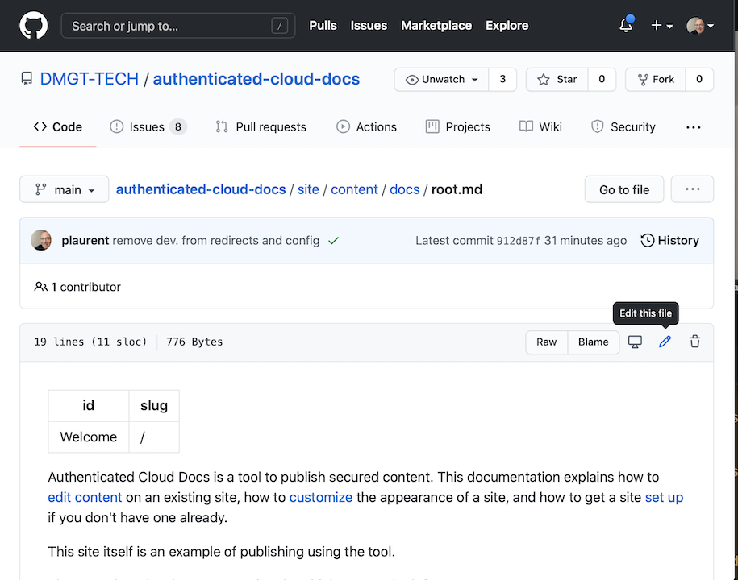
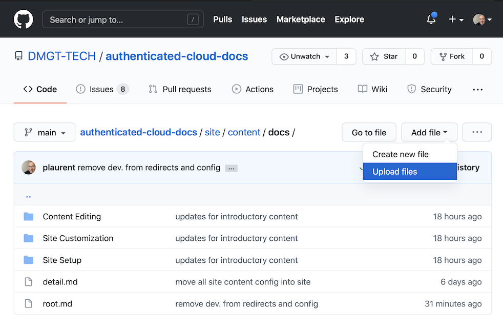
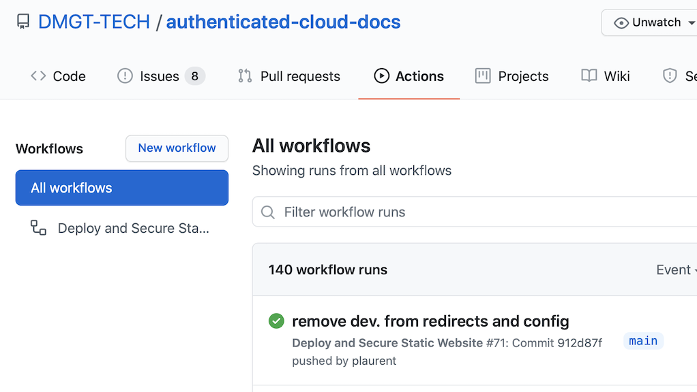

Non-technical users can make their edits directly on Github.com via a web browser.

## Editing Content

Changes to site are made by editing files on Github.com. Click the "Edit" link at the bottom of the page to be brought to the repository.  (You'll need to have a Github account and be logged into Github.com for this to work.)

> 
**Figure 1.** **Edit Button**. You can edit content directly on Github.com.

## Content Format

Content needs to be formatted in [Markdown format](https://daringfireball.net/projects/markdown/syntax).  Briefly, you use pound/hash signs for headings (# is H1, ## is H2), asterisks and underscores for bold and italicizing.

## Adding Images and Documents

You can also upload files from your local computer. This works for images, attachments, etc.  Once they're uploaded you can link to them from within documents.

Here's what uploading looks like:

> 
**Figure 2.** **Upload Button**. This figure shows how to upload content to a folder in the repository.  All content will be deployed to the secured published site.

## Checking the Status

Every time you make an edit, a service called Github Actions automatically detects this and publishes an updated version of the site online. However, this process takes 5-8 minutes. You can check the status of the deployment by looking at the Github Action.  Simply click on Actions at the top of your repository.

If there were any errors during the deployment, you'll see the errors in the output of the Actions.

:::note Publishing Errors may arise with Multiple Rapid Edits in a Row

If you make several edits in a row, some of them may fail because of ongoing publishing triggered by one of the edits. You can ignore this and simply re-run the action at the end. (For example, you could make a final edit to trigger another publishing run).  A more advanced option is to coalesce all your changes into a single pull request.  Meanwhile, we're working on optimizing the process to minimize these errors.

:::

Here is what the Actions screen looks like after a successful publishing step:

> 
**Figure 3.** **Checking the Github Action Status**. By clicking Action you'll be able to see the Github actions that are in progress, completed, or that have errrored.

